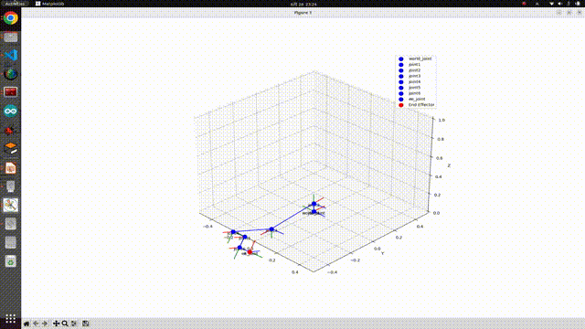

# URDF to DH Parameterization

v0.0.2

Sometimes people want DH.

## Documentation

Check out the [documentation](https://mcevoyandy.github.io/urdf_to_dh/index.html) for more details on how the conversion is done and how to use this package.

## Getting started

To run the code without any ROS2 installation on the host computer, use [docker](https://docs.docker.com/engine/install/ubuntu/) along with [docker compose](https://docs.docker.com/compose/install/linux/).

Then, in the root folder, run the following:

```bash
docker compose build
docker compose up -d
```

This will build then run the docker container. To access it interactively with a bash terminal, run:

```bash
docker exec -it <name_of_container> bash
docker exec -it urdf_to_dh-ros2-1 bash # by example, in our case
```

## Access implemented code inside container

To access your current work without modifying your docker compose configuration, just copy paste your code inside the "src/ros_ws/temp" folder. It will not be pushed on github repository but will be available in your container.

## Running the node

```sh: terminal
ros2 run urdf_to_dh generate_dh --ros-args -p urdf_file:="<path_to_my_urdf>"
# ex.)
ros2 run urdf_to_dh generate_dh --ros-args -p urdf_file:=/home/ubuntu/dev_ws/src/urdf_to_dh/urdf/ur5.urdf
```

## DH parameters confirm
To check the robot link, do the following:

```sh: terminal
python3 view_trajectory_dh.py
```

To check the trajectory in 3D animation, do the following:

```sh: terminal
python3 view_trajectory3d_dh.py
```


